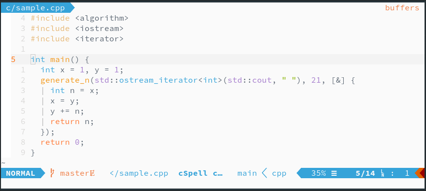
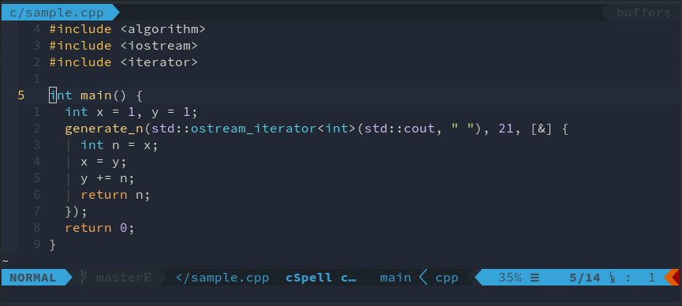
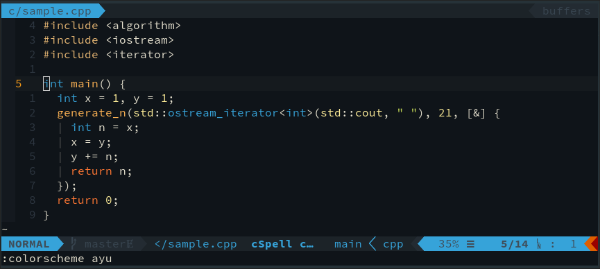

# [Ayu](https://github.com/dempfi/ayu)

> Simple, Bright and Elegant theme for Sublime Text

Originally made for Sublime, this theme has been ported to a number of
applications. There are three variants of this theme _light_, _mirage_, and
_dark_.

I like the vibrant colors and dark background. I think that the colors are well
suited for each other, and are not too offensive. Unfortunately, there are not
many ports for this theme to other applications. However, there is a relatively
clear specification for the usage of the color scheme, which means it is
relatively easy to create custom themes for different programs.

Also there is no official website, or dedicated repository. There only exist the
different repositories for the implementations.

## Screenshots

### Light

### Mirage 

### Dark

## Ports

* Sublime
* Ace
* Typescript
* VSCode
* XCode
* Vim
