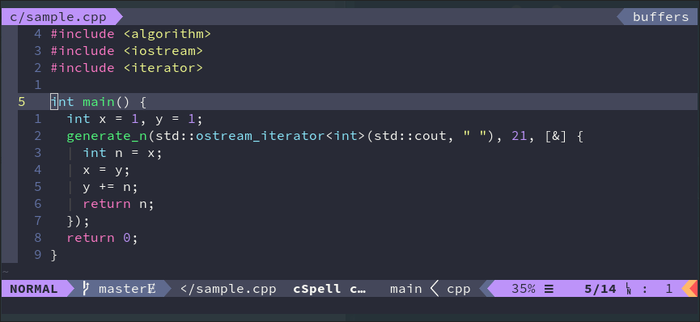

# [Dracula](https://draculatheme.com/)

> Dark theme for ...

Dracula is one of the largest color schemes, it has been ported to hundreds of
programs, and almost any program has a port for hit. This means that it is
possible to configure all applications to use the same scheme, without much
issue. However, there is not a precise guide on the usage of the colors, so
different ports may not match exactly.

Personally I find that the theme is too leaned towards purple and green colors.
I appreciate the vast number of applications that have this theme, but
aesthetically I find it not for me. I also think that the colors, especially the
green could be too vibrant, and can be distracting.

## Screenshots

## Ports

* Adobe
* Alacritty
* Alfred
* Arduino IDE
* Atom
* Base16
* BBEdit
* Bear
* Blender
* Brackets
* bspwm
* Chrome
* Cmder
* Coda
* ConEmu
* CotEditor
* Couscous
* Discourse
* DuckDuckGo
* Eclipse
* Editplus
* Emacs
* Facebook Messenger
* Figma
* Firefox
* Fish
* Fluent Terminal
* GameMaker Studio
* Geany
* Gedit
* Github Pages
* Gitk
* GMK
* Gnome Terminal
* Godot
* Highlight.js
* Hyper
* i3
* Insomnia
* iTerm
* Javadoc
* JetBrains
* jGrasp
* JupyterLab
* Kakoune
* Kate
* Kitty
* Konsole
* Light Table
* LightPaper
* LimeChat
* MacDown
* Mattermost
* MindNode
* Mintty
* MobaXterm
* MonoDevelop
* Mutt
* Notepad++
* Nylas N1
* Oracle SQL Developer
* PowerShell
* Prism
* Pygments
* Pythonista
* Qt Creator
* Quassel
* Quiver
* Qutebrowser
* React DevTools
* rofi
* Sequel Pro
* Sketch
* Slack
* Steam
* Sublime
* Tabletop Simulator
* Telegram
* Telegram Android
* Terminal.app
* Termite
* Termux
* Textmate
* Textual
* Tilix
* tmux
* Typora
* Ulauncher
* Ulysses
* Vim
* Vimium
* Visual Studio
* Visual Studio Code
* Vivaldi
* Windows Terminal
* Wing
* wofi
* Wordpress
* Wox
* XChat
* Xcode
* Xresources
* Zsh
