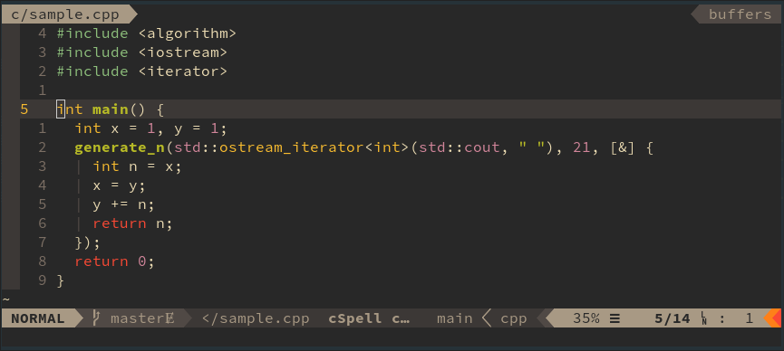

# [Gruvbox](https://github.com/morhetz/gruvbox)

> Retro groove color scheme for Vim

Gruvbox is another very popular theme, which has a more retro vibe. I have
not used this theme yet, but from my experience, the colors are relatively
muted. It is very easy on the eyes, and has a light and dark variant, and
several levels of contrast.

Because of its popularity there are many ports to other applications, but none
of them are official. The only official usage of this theme is for Vim.

## Screenshots

## Ports

* Emacs
* Vim
