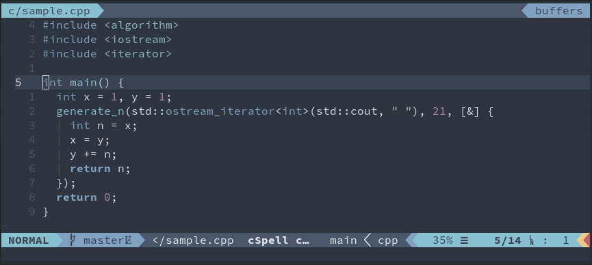

# [Nord](https://www.nordtheme.com/)

> An arctic, north-bluish color palette.

Focused on clean and uncluttered design, has a low contrast colors.

I think that this is a good theme, but the low contrast can be bothersome at
times, and everything can blend together. I usually prefer things to be a bit
more contrasting, so that the colors pop more. However, I will note that all of
the colors are very nice to look at and are not harsh in any way. It is
defiantly a good color scheme, but the muted look of the colors means it is not
for me.

## Screenshots

## Ports

* Alacritty
* Atom
* AtomUI
* Brackets
* Coda
* ConEmu
* dircolors
* Eclipse Syntax
* Emacs
* Guake
* GNOME Terminal
* gedit
* highlight.js
* Hyper
* iTerm2
* Java
* JetBrains
* Konsole
* Mintty
* Notepad++
* PuTTY
* Slack
* Sublime
* Terminal.app
* Terminator
* Termite
* Tilix
* tmux
* Vim
* Visual Studio Code
* Xcode
* Xfce Terminal
* Xresources
